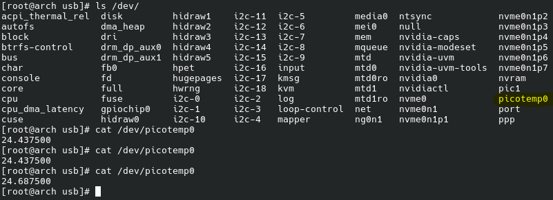

# Pico USB Temperature

A simple Linux kernel module and RP2040 firmware combo for reading temperature data from DS18B20 over USB. The Pico acts as a USB device using TinyUSB, and the kernel module provides a character device interface at ```/dev/picotempX```.

Simply ```cat /dev/picotempX``` where X is actual device ID (check with ```ls /dev/```) to get temperature info.

## Screenshots and pictures



## Dependencies

This project was developed and tested on Arch Linux.
For the Kernel Module:
* base-devel (includes make, gcc, etc.)
* linux-headers (matching your current kernel version)

For the RP2040 Pico:
* arm-none-eabi-gcc
* arm-none-eabi-newlib
* cmake
* pico-sdk (ensure PICO_SDK_PATH is exported in your environment)

## Hardware

Microcontroller: Raspberry Pi Pico (RP2040)

Sensor: DS18B20 1-Wire Temperature Sensor

Wiring:

    Data Pin: GPIO 26

    VCC/GND: 3.3V and Ground accordingly.

    Note: Ensure a 4.7kΩ pull-up resistor is between Data and VCC if your sensor module doesn't have one built-in.